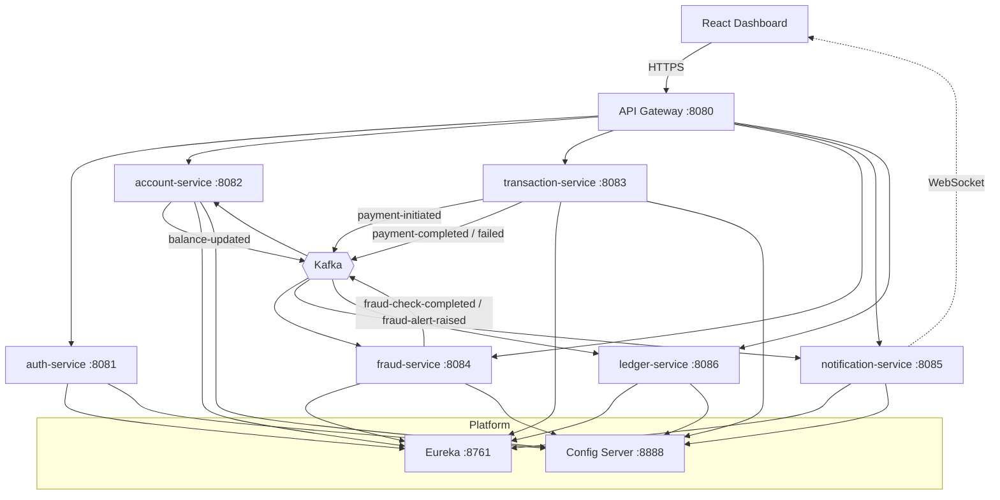
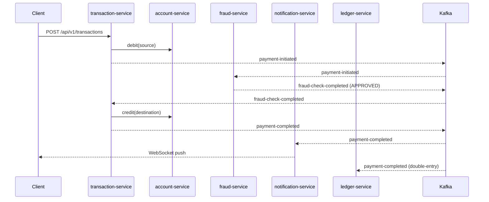

# PayStream

A production-grade, event-driven payment processing platform built with Spring Boot 3, Apache
Kafka, PostgreSQL, Redis, and React 18. PayStream demonstrates Saga orchestration, CQRS, the
Transactional Outbox, real-time fraud detection, an immutable double-entry ledger, and live
WebSocket notifications — wired together with full observability.

## Architecture



### Payment saga (happy path)



On any failure the saga runs **compensating transactions** (reverse the debit) and marks the
transaction `FAILED`.

## Services

| Service | Port | Responsibility | Key patterns |
|---|---|---|---|
| eureka-server | 8761 | Service discovery | — |
| config-server | 8888 | Centralised config | Spring Cloud Config (native) |
| api-gateway | 8080 | Single ingress | JWT validation, Redis rate limit, correlation id |
| auth-service | 8081 | AuthN + JWT | RSA-256 + JWKS, login lockout, BCrypt-12 |
| account-service | 8082 | Balances | CQRS, optimistic locking, Transactional Outbox |
| transaction-service | 8083 | Payments | Saga orchestration, Resilience4j, compensation |
| fraud-service | 8084 | Risk scoring | Rule engine (velocity/amount/geo) over Kafka |
| notification-service | 8085 | Real-time + email | WebSocket/STOMP, Redis presence, email fallback |
| ledger-service | 8086 | Accounting | Immutable double-entry, DB trigger, reconciliation |
| frontend | 5173 | Dashboard | React 18 + TS + Tailwind + TanStack Query |

## Quick start

Prerequisites: Docker (or Podman) with Compose, JDK 21 (only needed for local non-container builds).

```bash
cp .env.example .env
docker compose up --build         # builds platform + all services + frontend + infra
```

Then open:
- Dashboard: http://localhost:5173
- API Gateway: http://localhost:8080
- Eureka: http://localhost:8761
- Grafana: http://localhost:3000 (admin/admin)
- Prometheus: http://localhost:9090
- MailHog (captured emails): http://localhost:8025

### Build & test (without containers)

```bash
# Requires a JDK 21 toolchain. If your default `java` differs from `javac`, pin it:
export JAVA_HOME=/path/to/jdk-21
./mvnw verify                     # builds all modules + runs unit/integration tests (Testcontainers)
cd frontend && npm install && npm run test -- --run && npm run build
```

> Tests use Testcontainers and require a running Docker daemon (Podman works too — set
> `DOCKER_HOST` to the Podman socket and `TESTCONTAINERS_RYUK_DISABLED=true`).
> Verified green: 9/9 Maven modules (22 tests) + frontend (5 tests).

## Tech stack

- **Backend:** Spring Boot 3.3, Java 21 (virtual threads), Spring Security 6, Spring Cloud
  (Gateway, Config, Eureka), Spring Kafka, Spring Data JPA + Flyway, Resilience4j, Nimbus JOSE.
- **Data:** PostgreSQL 16 (one DB per stateful service), Redis 7.2, Apache Kafka 3.7.
- **Frontend:** React 18, TypeScript 5 (strict), Vite, Tailwind CSS, Zustand, TanStack Query,
  React Hook Form + Zod, Recharts, STOMP/SockJS, Framer Motion.
- **Observability:** Micrometer + Prometheus + Grafana, structured JSON logs (Loki-ready),
  X-Correlation-ID propagation, Actuator liveness/readiness probes.

## API documentation

Each service exposes OpenAPI 3.1 at `/swagger-ui.html` and the raw spec at `/v3/api-docs`.

## Repository layout

See `.kiro/steering/structure.md`. Specs, design, requirements and the implementation task
breakdown live under `.kiro/specs/paystream/`. Architecture decisions are in `docs/adr/`.

## Notes / known follow-ups

- The auth-service generates an in-memory RSA key for local dev; set
  `paystream.auth.jwt.private-key-location` / `public-key-location` (PEM resources) to use a
  stable external key in production — no code change required.
- fraud-service ships a `MaxMindGeoIpResolver` that activates when
  `paystream.fraud.geo.database-path` points at a GeoIP2/GeoLite2 `.mmdb`; otherwise the safe
  fail-open stub is used.
- The Grafana Spring Boot JVM dashboard (ID 11378) is auto-provisioned
  (`monitoring/grafana/dashboards/spring-boot-jvm-11378.json`) alongside the custom PayStream board.
- Internal endpoints (auth-service `/api/v1/users/**`) require a shared `X-Internal-Key`
  (`INTERNAL_API_KEY`); prefer mTLS / service-mesh identity on top of this in production.

### Recently closed
- **Pre-emptive fraud 403** — transaction-service consults fraud-service for the user's cumulative
  risk score and rejects initiation with HTTP 403 above the configurable threshold (default 80).
- **Kafka DLQ + retry** — every consumer retries with backoff and dead-letters to `<topic>.DLT`.
- **Outbox retention** — scheduled cleanup purges published outbox rows past the retention window.
- **Email recipient lookup** — notification-service resolves real addresses from auth-service
  (`/api/v1/users/{id}/email`), falling back to a placeholder only if the lookup fails.
- **External RSA key, MaxMind geo, internal-endpoint key, auto-provisioned JVM dashboard** —
  all wired (see above).
# paystream
